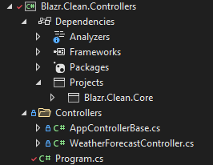

# API Controllers

API Controllers are presentation layer classes.  They reside in a separate *Controllers* project.



We create a controller per recordset and use generics to boilerplate code into an abstract base class.

Note that some of the libraries required are not compatible with Blazor WASM compilation.

### AppControllerBase

```csharp
[ApiController]
public abstract class AppControllerBase<TRecord> 
    : Mvc.ControllerBase
    where TRecord : class, new()
{
    private IDataBroker _dataBroker;

    public AppControllerBase(IDataBroker dataBroker)
        => _dataBroker = dataBroker;

    [Mvc.Route("/api/list/[controller]")]
    [Mvc.HttpPost]
    public virtual async Task<IEnumerable<TRecord>> GetRecordsAsync([FromBody] ListOptions options)
        => await _dataBroker.GetRecordsAsync<TRecord>(options);

    [Mvc.Route("/api/add/[controller]")]
    [Mvc.HttpPost]
    public virtual async Task<bool> AddRecordAsync([FromBody] TRecord record)
        => await _dataBroker.AddRecordAsync<TRecord>(record);
}
```

In this instance I've made the two methods virtual so we can override them to demonstrate the two data pipelines.

### WeatherForecastController

`WeatherForecastController` is the concrete implementation for `WeatherForecast`.
  
```csharp
[ApiController]
public class WeatherForecastController : AppControllerBase<WeatherForecast>
{
    public WeatherForecastController(IDataBroker dataBroker) 
        : base(dataBroker)
    {}
}
```
