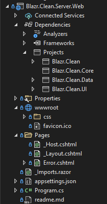
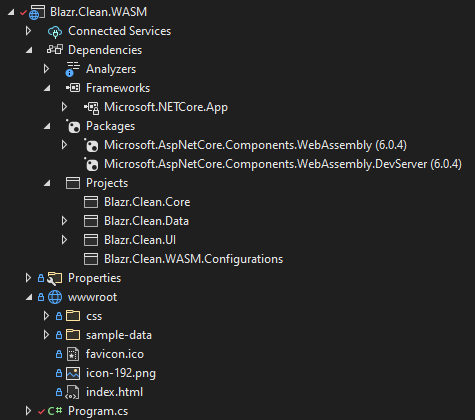
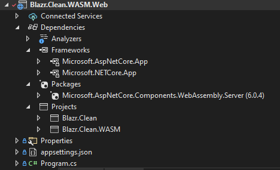
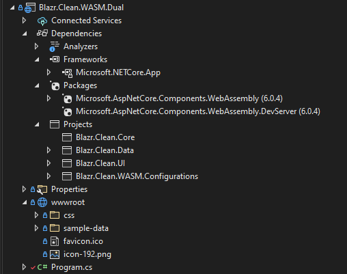
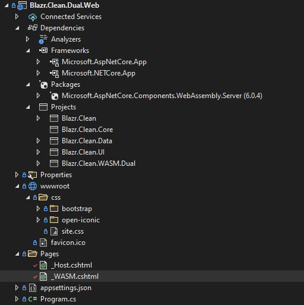

# Applications

So far we've built a set of libraries, there's no actual application.  These are implemented in separate projects.

Before we jump into the projects, we set up a `ServicesExtensions` static class in *Blazr.Clean* to hold the server application configurations.  This keeps all the server configurations in one place.

```csharp
public static class ServiceExtensions
{
    public static void AddBlazorInMemoryServerAppServices(this IServiceCollection services)
        => AddBlazorServerAppServices<InMemoryDbContext>(services, options => options.UseInMemoryDatabase("TestDb"));

    public static void AddBlazorServerAppServices<TDbContext>(this IServiceCollection services, Action<DbContextOptionsBuilder>? optionsAction)
        where TDbContext : DbContext
    {
        services.AddDbContextFactory<TDbContext>(optionsAction);
        services.AddSingleton<IDataBroker, ServerDataBroker>();
        services.AddScoped<IViewService<WeatherForecast>, WeatherForecastViewService>();
    }

    public static void AddServerAppServices<TDbContext>(this IServiceCollection services, Action<DbContextOptionsBuilder>? optionsAction)
        where TDbContext : DbContext
    {
        services.AddDbContextFactory<TDbContext>(optionsAction);
        services.AddSingleton<IDataBroker, ServerDataBroker>();
    }
}
```

We can't keep the WASM configurations here due to WASM compilation incompatibilities.  These live in a separate *Blazr.Clean.WASM.Configurations* project.

```csharp
public static class ServiceExtensions
{
    public static void AddBlazorWASMAppServices(this IServiceCollection services)
    {
        services.AddScoped<IDataBroker, APIDataBroker>();
        services.AddScoped<IViewService<WeatherForecast>, WeatherForecastViewService>();
    }
}
```

## Blazor Server Application (Blazr.Clean.Server.Web)

The project is a Blazor Server template project with all thw Blazor component stuff removed.  Set this project as the startup project to run the Blazor Server application.



All we need do is set the correct `App` component we want to start as the root component and make sure we have the necessary services loaded.

#### _Hosts.cshtml

The `component` tag needs to point to the correct startup `App`. 

```html
<component type="typeof(Blazr.Clean.UI.App)" render-mode="ServerPrerendered" />
```

The full `Program.cs`
```csharp
using Blazr.Clean;

var builder = WebApplication.CreateBuilder(args);

// Add services to the container.
builder.Services.AddRazorPages();
builder.Services.AddServerSideBlazor();
builder.Services.AddBlazorInMemoryServerAppServices();

var app = builder.Build();

// Configure the HTTP request pipeline.
if (!app.Environment.IsDevelopment())
{
    app.UseExceptionHandler("/Error");
    app.UseHsts();
}

app.UseHttpsRedirection();

app.UseStaticFiles();

app.UseRouting();

app.MapBlazorHub();
app.MapFallbackToPage("/_Host");

app.Run();
```

## Blazor WASM Application (Blazr.Clean.WASM)

This is a Blazor WASM template project with all the Blazor code removed.  This project builds the WASM executables and support files needed to the run the WASM application. 



`Program.cs`, pointing the root component to the correct `App`, and loading the correcvt services through the Service Extensions.

```csharp
var builder = WebAssemblyHostBuilder.CreateDefault(args);
builder.RootComponents.Add<Blazr.Clean.UI.App>("#app");
builder.RootComponents.Add<HeadOutlet>("head::after");
builder.Services.AddBlazorWASMAppServices();

builder.Services.AddScoped(sp => new HttpClient { BaseAddress = new Uri(builder.HostEnvironment.BaseAddress) });

await builder.Build().RunAsync();
```

## Blazor WASM Web Server

The is the web server for launching the WASM SPA.  It's a DotNetCore Web Server project with almost everything removed.



`Program` is configured as follows:

```csharp
using Blazr.Clean;
using Blazr.Clean.Data;
using Microsoft.AspNetCore.Mvc.ApplicationParts;
using Microsoft.EntityFrameworkCore;

var builder = WebApplication.CreateBuilder(args);

// Add services to the container.
builder.Services.AddRazorPages();
builder.Services.AddServerAppServices<InMemoryDbContext>(options => options.UseInMemoryDatabase("TestDb"));
// Add the controllers from the controllers project
builder.Services.AddControllers().PartManager.ApplicationParts.Add(new AssemblyPart(typeof(Blazr.Clean.Controllers.WeatherForecastController).Assembly));

var app = builder.Build();

// Configure the HTTP request pipeline.
if (!app.Environment.IsDevelopment())
{
    app.UseExceptionHandler("/Error");
    app.UseHsts();
}

app.UseHttpsRedirection();
// Add the framework files middleware
app.UseBlazorFrameworkFiles();
app.UseStaticFiles();

app.UseRouting();

app.UseAuthorization();

app.MapRazorPages();
// Map the controllers
app.MapControllers();
// Default endpoint pointing to the WASM startup page
app.MapFallbackToFile("index.html");

app.Run();
```

## Dual Hosted Application

This configuration hosts both the Blazor WASM and Server SPAa on the same site, and lets you interchange between them.

To differential these from the other applications I've added different layouts and Nav menu components to *Blazr.Clean.UI*.

1. Changed the Layout `sidebar` colour:

```css
.sidebar {
    background: rgb(128, 0, 0);
}
```

2. Change the menu options in the sidebar - this is `DualWASMNavMenu`:

```html
        <div class="nav-item px-3">
            <NavLink class="nav-link" href="" Match="NavLinkMatch.All">
                <span class="oi oi-home" aria-hidden="true"></span> Home
            </NavLink>
        </div>
        <div class="nav-item px-3">
            <NavLink class="nav-link" href="/" Match="NavLinkMatch.All">
                <span class="oi oi-home" aria-hidden="true"></span> Server Home
            </NavLink>
        </div>
```

3. Added two new `App.razor` components as root components.  They are are same as the standard `App`, but use the two different Layouts.  This is the WASM version

```html
@namespace Blazr.Clean.UI

<Router AppAssembly="@typeof(App).Assembly">
    <Found Context="routeData">
        <RouteView RouteData="@routeData" DefaultLayout="@typeof(DualWASMLayout)" />
        <FocusOnNavigate RouteData="@routeData" Selector="h1" />
    </Found>
    <NotFound>
        <PageTitle>Not found</PageTitle>
        <LayoutView Layout="@typeof(DualWASMLayout)">
            <p role="alert">Sorry, there's nothing at this address.</p>
        </LayoutView>
    </NotFound>
</Router>
```

### Blazr.Clean.WASM.Dual

This is the WASM build project.  It's the same configuration as *Blazr.Clean.WASM* with the following changes:



1. Added `StaticWebAssetBasePath` property to the project file.

```xml
  <PropertyGroup>
....
	  <StaticWebAssetBasePath>wasm</StaticWebAssetBasePath>
  </PropertyGroup>
```

2. Setting the root component in `Program` to the appropriate `App`

```csharp
builder.RootComponents.Add<Blazr.Clean.UI.DualWASMApp>("#app");
```

### Blazr.Clean.Dual.Web

This is a standard Blazor Server project with almost everything removed.



The two application launch files look like this:

**_Host.cshtml**

```html
@page "/"
@using Microsoft.AspNetCore.Components.Web
@namespace Blazr.Clean.Server.Web.Pages
@addTagHelper *, Microsoft.AspNetCore.Mvc.TagHelpers

<!DOCTYPE html>
<html lang="en">
<head>
    <meta charset="utf-8" />
    <meta name="viewport" content="width=device-width, initial-scale=1.0" />
    <base href="~/" />
    <link rel="stylesheet" href="css/bootstrap/bootstrap.min.css" />
    <link href="css/site.css" rel="stylesheet" />
    <link href="Blazr.Clean.Dual.Web.styles.css" rel="stylesheet" />
    <component type="typeof(HeadOutlet)" render-mode="ServerPrerendered" />
</head>
<body>
    <component type="typeof(Blazr.Clean.UI.DualServerApp)" render-mode="ServerPrerendered" />

    <div id="blazor-error-ui">
        <environment include="Staging,Production">
            An error has occurred. This application may no longer respond until reloaded.
        </environment>
        <environment include="Development">
            An unhandled exception has occurred. See browser dev tools for details.
        </environment>
        <a href="" class="reload">Reload</a>
        <a class="dismiss">🗙</a>
    </div>

    <script src="_framework/blazor.server.js"></script>
</body>
</html>
```

**_WASM.cshtml**

```html
@page "/wasm"
@addTagHelper *, Microsoft.AspNetCore.Mvc.TagHelpers

<!DOCTYPE html>
<html>

<head>
    <meta charset="utf-8" />
    <meta name="viewport" content="width=device-width, initial-scale=1.0, maximum-scale=1.0, user-scalable=no" />
    <title>WASM</title>
    <base href="/wasm/" />
    <link href="/wasm/css/bootstrap/bootstrap.min.css" rel="stylesheet" />
    <link href="/wasm/css/app.css" rel="stylesheet" />
    <link href="/wasm/Blazr.Clean.WASM.Dual.styles.css" rel="stylesheet" />
</head>

<body>
    <div id="app">
        <div class="mt-4" style="margin-right:auto; margin-left:auto; width:100%;">
            <div class="loader"></div>
            <div style="width:100%; text-align:center;"><h4>Web Application Loading</h4></div>
        </div>
    </div>

    <script src="/wasm/_framework/blazor.webassembly.js"></script>
</body>

</html>
```

`Program` is set up with multiple endpoints to handle launching the two SPAs.

```csharp
var builder = WebApplication.CreateBuilder(args);

// Add services to the container.
builder.Services.AddRazorPages();
builder.Services.AddServerSideBlazor();

builder.Services.AddBlazorInMemoryServerAppServices();
builder.Services.AddControllers().PartManager.ApplicationParts.Add(new AssemblyPart(typeof(Blazr.Clean.Controllers.WeatherForecastController).Assembly));

var app = builder.Build();

// Configure the HTTP request pipeline.
if (!app.Environment.IsDevelopment())
{
    app.UseExceptionHandler("/Error");
    app.UseHsts();
}

app.UseHttpsRedirection();
app.UseStaticFiles();

app.MapWhen(ctx => ctx.Request.Path.StartsWithSegments("/wasm"), app1 =>
{
    app1.UseBlazorFrameworkFiles("/wasm");
    app1.UseRouting();
    app1.UseEndpoints(endpoints =>
    {
        endpoints.MapFallbackToPage("/wasm/{*path:nonfile}", "/_WASM");
    });

});

app.UseRouting();
app.MapRazorPages();
app.MapBlazorHub();
app.MapControllers();
app.MapFallbackToPage("/_Host");

app.Run();
```


