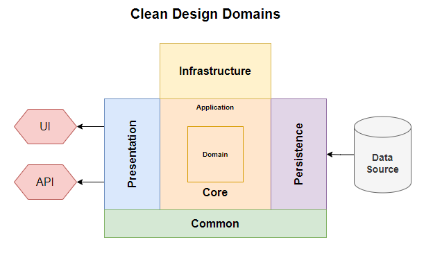
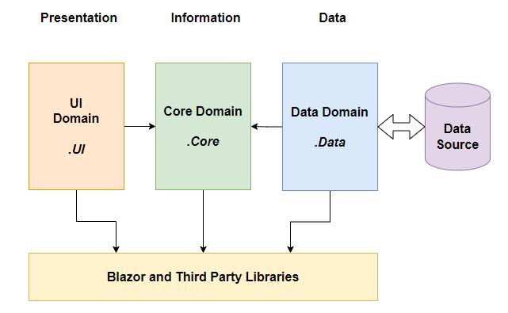

# Project Architecture and Design

## Clean Design

Clean design is a modern software design architecture appropriate for Web based projects.  In it's most basic implementation it's neither heavy duty or requires a training course to understand and implement.

It's core principle is the **Dependancy Rule**.  Clean design can be visualized as a set of concentric rings.  Each ring can only depend on an inner layer.  Specifically a domain can have no dependencies on a domain in an outer ring or a domain in the same ring.  The diagram below shows the principle rings.



In smaller projects the domain and application rings are often combined into a single core ring.


The glue that makes Clean Design possible is abstraction and dependency injection.

1. Abstraction is the process of defining connections between domains as interfaces.
2. Dependency Injection is software framework that manages the lifecycle of object instances within a DI container.   

It's easier to demonstrate the principles, that try to provide a detailed explanation.

Taking the Blazor Server Template `WeatherForecast`, lets look at how we can refactor some of the code.

`FetchData` requires a collection of WeatherForecasts.  We can define a View interface that provides the data.

```csharp
public interface IWeatherForecastView
{
    public IEnumerable<WeatherForecast> WeatherForecasts {get;}
    public void GetWeatherForecasts();
}
```

And implement a class version of that interface:

```csharp
public class WeatherForecastView : IWeatherForecastService
{
    public IEnumerable<WeatherForecast> WeatherForecasts {get; private set;} = new List<WeatherForecast>();
    
    public void GetWeatherForecasts()
    {
        // Go away and get the data
        // assign to this.WeatherForecasts 
    }
}
```

This can be registered in the DotNetCore Dependency Injection container in `Program`:

```csharp
builder.Services.AddScoped<IWeatherForecastView, WeatherForecastView>();
```

Note that the registration is as `IWeatherForecastView`.  

`FetchData` can now use it by injection of `IWeatherForecastView`

```csharp
@inject IWeatherForecastView

//show as table IWeatherForecastView.WeatherForecasts
```

We have abstracted the core domain View from the UI.  All UI interaction with the view class is through the interface.  We can register a different `IWeatherForecastView` implementation class in the services container and the UI would not know the difference.  It will work with any class that implements the `IWeatherForecastView` interface.




The separation of concerns principles are enforced through projects and project dependancies.  All the application code resides in libraries.  The applications, in this case Blazor Server and Blazor WASM SPAs, are endpoints.

## Coding Standards

I (try to) implement good code practices throughout the solution: principally SOLID and CQRS.  I use coding patterns where appropiate.

Dependancy Injection is probably the most important SOLID principle to understand and implement in Blazor.  You'll see it implemented throughout the solution.

## Generics and Boilerplating

Generics let us boilerplate code.  A common design pattern is:

1. An `interface` to define the common functionality and abstraction.
2. An `abstract` base class that implements the interface functionality using generics.
3. Concrete implementation class that simply fix the generics and inherit their functionality from the base class.

One interface, one abstract class, many concrete implementations.

We can see this in the View Services.  The concrete `WeatherForecastViewService` looks like this:

```csharp
public class WeatherForecastViewService : ViewServiceBase<WeatherForecast>
{
    public WeatherForecastViewService(IDataBroker dataBroker)
        : base(dataBroker)
    { }
}
```

## Database Access

I use an ORM [Object-Relational Mapper] to simplify database access.  In this project I've stuck with mainstream Entity Framework, but could have used Dapper or Linq2DB.

There's no classic Repository Pattern implementation.  Instead I use a generics based Data Broker pattern that removes most of the repository pattern complexity.  Generics are applied at the method level: one data broker service handles CRUD and List operations for all data sets.

I keep EF simple, `DataSets` map directly to database tables and views.  I'm a firm believer in clean design: the relationships between data objects is part of the application/business logic and belongs in the core domain, definitley not the Data layer! 
