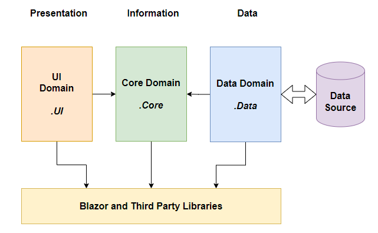

# Building a Clean Design Blazor Application

In this article I cover the basics of how to put together a well structured and written Blazor Application.  This is not an attempt at "Blazor Best Practices" or "The Way to write a Blazor Application".  Choose whatever methodologies and coding practices you wish.  Don't develop your first Blazor application without making those choices!

I've tried to keep this as simple.  I've taken the out-of-the-box Blazor template and rebuilt it concentrating on restructuring the `FetchData` page and the data pipeline behind it.

The Github repository contains a fairly comprehensive set of notes.  This article provides an overview of the project.  For detail go to the repository.

## Project Architecture/Design

I apply Clean Design principles to my projects.  The basic architecture looks like this:



This separates code out into three primary domains:

1. **Data Domain** - this contains all the code specific to the data source.

2. **Core/Application Domain** - this contains the application and business logic of the application.

3. **UI Domain** - this contains all the UI code.  It's specific to the UI framework used for the application.

The key concept we are trying to achieve is to remove any dependancies our core domain code has on the Data, UI or any support domain code.  The core defines the interfaces it uses to communicate downward with the data domain and the interfaces it provides upward to the UI.  In principle we can change out the data source from a SQL database to an API and the core domain doesn't change.  We can plug different front ends onto the same core domain code.

Let's look at how we achieve this is the solution.

### One Solution Many Projects

You'll notice that the solution has a lot of projects.  That's by design.  Each project represents a code domain or application endpoint.  Using projects we can tightly control and manage our interdependancies, and separate out blocks of code that are used by different application endpoints.  Two examples:

1. The Core project has no project dependancies: it doesn't on the data or UI domain code.
2. The API controllers are used in two application endpoints.  So we break then out into a library project.  They also have specific library requirements which mean we can't mix them with a WASM project code. 

You'll also notice that most of the projects, including the primsry domain projects are standard libraries.

1. Data and Core don't contain any Blazor specific code.
2. UI is a Razor library.
3. The WASM projects are specific.

 
### What goes in the Core Domain?

Answer:  Anything it needs to use.

Here's the Core project.  It's divided into *entities* to keep together all the code modules for each data set e.g. Weather Forecasts.  *Base* contains all the interfaces and base classes.


Note the `WeatherForecastViewService` and the `WeatherForecast` data class.  First pass would suggest that data classes belong in the data domain. But, consider who will use them?  All the domains: so based on our clean design dependancy model, they belong in the core domain.

### Interfaces and Dependancy Injection

We use interfaces to define the communications between our primary domains.

#### Core to Data

In this application the core only needs the following functionality from the data domain:

1. Provide a collection of Weather Forecasts
2. Add ats Weather Forecast to the data set.

We can define that in our interface:

```csharp
public interface IDataBroker
{
    public ValueTask<IEnumerable<TRecord>> GetRecordsAsync<TRecord>(ListOptions options) where TRecord: class, new();
    public ValueTask<bool> AddRecordAsync<TRecord>(TRecord record) where TRecord : class, new();
}
```

`GetRecordsAsync` is a CQRS query method that returns an `IEnumerable` constrained collection.  I don't code "get all" methods without constraints: you can never guarantee how many records a query will return.  The `ListOptions` object defines the paging.

```csharp
public class ListOptions
{
    public int StartIndex { get; set; } = 0;
    public int PageSize { get; set; } = 1000;
}
```

`AddRecordAsync` is a CQRS command method.  It returns a status `bool`.

Each method uses generics.  Each call defines which specific data class to retrieve.  We'll see how this gets implemented in the data domain shortly.


#### UI to Core

UI to core communications are more complex.  As the UI depends on the Core then strictly there's no need to implement specific code interfaces, just define the public objects and methods/properties.

However, interfaces help boilerplate our code.  This application defines an `IViewService` to standardise the normal functionality data set views implement.

1. `ListUpdated` is an event raised whenever `Records` is updated.
2. `Records` holds the current record collection based on the last `GetRecordsAsync` call.
3. `Record` holds the currently active recordset record.
4. `AddRecordAsync` adds the current record to the data store.
5. `GetRecordsAsync` retrieves a recordset based on the `ListOptions` provided into the `Records` collection.

```csharp
public interface IViewService<TRecord> where TRecord : class
{
    public event EventHandler? ListUpdated;
    public IEnumerable<TRecord> Records { get; }
    public TRecord Record { get; }
    public ValueTask<bool> AddRecordAsync();
    public ValueTask GetRecordsAsync(ListOptions options);
}
```

It's important to understand that the view holds the data, not the UI components.

Services are loaded into the application in Program.  Herer's the service definitions for the Blazor Server application.


```csharp
        services.AddSingleton<IDataBroker, ServerDataBroker>();
        services.AddScoped<IViewService<WeatherForecast>, WeatherForecastViewService>();
```

## Generics

Generics are an important concept to undertand.  They help you create reusable code that you would otherwise need to repeat for each object type.

The application implements method level generics in the data brokers and class level generics in the view services.

### Data Broker Generics

Let's look at the `GetRecordsAsync` in the `ServerDataBroker`.
 
```csharp
public async ValueTask<IEnumerable<TRecord>> GetRecordsAsync<TRecord>(ListOptions options) where TRecord : class, new()
{
    using var dbContext = database.CreateDbContext();

    // build the query against the DataSet
    // dbContext.Set<T> finds the correct DataSet in the DbContext and returns it as an IQueryable collection
    IQueryable<TRecord> query = dbContext.Set<TRecord>();

    // Add the paging if the PageSize is not zero
    if (options.PageSize != 0)
    {
        query = query
        .Skip(options.StartIndex)
        .Take(options.PageSize);
    }

    // run the query and return the resulting IEnumerable collection
    return await query
        .ToListAsync();
}
``` 

1. Get a `DbContext` from the factory.
2. Use this context to get an `IQueryable` instance of our data set.  Under the hood `dbContext.Set` finds the appropiate `DataSet` object and returns that object.
3. Build the query based on the `ListOptions`.
4. Execute the query asynchronously and return the result.

### View Generics

`ViewServiceBaae` is the generic implementation of `IViewService`.  

```csharp
public abstract class ViewServiceBase<TRecord> : IViewService<TRecord> where TRecord : class, new()
```

`_options` maintains the last `ListOptions` submitted and is used to refreah the list if a CUD operation changes the collection.

`Records` holds the current paged collection.
```csharp
private ListOptions _options = new ListOptions { PageSize = 1000 };
    
public IEnumerable<TRecord> Records { get; protected set; } = new List<TRecord>();
```

`GetRecordsAsync` takes the class `TRecord` and uses it to call `GetRecordsAsync` on the data broker.  It saves the submitted `ListOptions` locally and then gets the record set collection and stores it in `Records`.
```csharp
public async ValueTask GetRecordsAsync(ListOptions options)
{
    _options = options;
    this.Records = await _broker.GetRecordsAsync<TRecord>(options);
}
```

The concrete implementation for `WeatherForecast` looks like this:

```csharp
public class WeatherForecastViewService : ViewServiceBase<WeatherForecast>
{
    public WeatherForecastViewService(IDataBroker dataBroker)
        : base(dataBroker)
    { }
}
```

Fix the generic type and call the base constructor.

