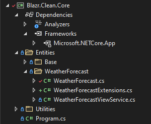

# Building a Clean Design Blazor Application

In this article I cover the basics of how to put together a well structured and written Blazor Application.  It's not an attempt at "Blazor Best Practices" or "This is the Way to write a Blazor Application".

What is does advocate is the need to have a structured framework in which you build your first Blazor application.  I see too many questions on StackOverflow and other platforms where my first reaction to the provided code is "Arghh": UI, business logic and data all mixed up in a component.

Choose whatever methodology you wish.  Just don't start your first Blazor application without one!

Coding practices are more clear cut.  Understand the SOLID principles and CQRS in objects.

I've tried to keep this simple.  I've taken the out-of-the-box Blazor template and rebuilt it concentrating on restructuring the `FetchData` page and the data pipeline behind it.

The Github repository contains a comprehensive set of notes.  This article provides an overview of the project.  For detail go to the repository.

**Entity Framework and Complex Data Entities**

It's common practice to implement complex data structures and relationships in Entity Framework.  It seems an obvious thing to do, and EF makes it easy.  I don't.  Why not? 

It breaks one of my fundimental design principles: business logic belongs in Core.  With EF you're building your business logic, the relationships between your basic data objects, into your data layer.  How do you change out your data store if EF doesn't fully support it?

## Project Architecture/Design

I'm a Clean Design advocate. It advocates a basic architecture that fits well with Blazor and looks like this:


It separates code into three primary domains:

1. **Data Domain** - this is what talks to the data store.  It's responsible for getting data from and persisting data to the data store/s.  It doesn't apply logic to that data.

2. **Core/Application Domain** - this contains all the application and business logic of the application.

3. **UI Domain** - this contains all the UI code.  It's specific to the UI framework used for the application.

The purpose of this separation is to remove all project dependancies in the core domain code.  The core domain should:

1. Be able to be tested independant of the data domain code
2. Deployed with alternative data or UI domain code without change.

To achieve this the core defines all communications downward with the data domain and upward to the UI through `interfaces`.

Let's look at how we achieve this is the solution.

### One Solution Many Projects

The solution has a significant number of projects: that's by design.  Each project represents a code domain or application endpoint.  With projects we can control and manage code dependancies.  For example:


1. The Core project has no project dependancies. You can't use classes and other code from the data domain if the data project isn't referenced.  It's also easy to check if you have dependancies you don't want.

2. The API controllers are used in multiple application endpoints, so we break then out into a library project.  They also have specific library requirements which mean we can't mix them with projects referenced by the WASM application build projects. 

Most projects, including the primary domain projects, are standard libraries.

1. Data and Core don't contain any Blazor specific code.
2. UI is a Razor library.
3. The WASM projects are specific, compiling and building the support files for deployement to the browser.
4. The endpoint application projects are standard DotNetCore web projects.
 
### What goes in the Core Domain?

Answer:  Anything that the core domain code uses.

Here's the Core project.  It's divided into *entities* to keep together all the code modules for each data set e.g. Weather Forecasts.  *Base* contains all the interfaces and base classes.



Our application is very simple so there's no real business logic code.  

WeatherForecast contains:

1. The `WeatherForecast` data class.  Surely that belongs in the data domain?  Consider who will use them?  All the domains including the core domain.  Clean design dictates data classes belong in the core domain.

2. The `WeatherForecastViewService`.  This services the UI components that display and interact with the data.

3. `WeatherForecastExtensions` is a small bit of business logic.  It extends the `WeatherForecast` class to provide `TemperatureF`.  This is a little contrived, but used to demonstrate design principles.  `TemperatureF`is a calculated value.  It doesn't belong in the base data class - it's not a database field!  It's treated here as business logic.  The simplest way to provide it is through a class extension.  

### Interfaces and Dependancy Injection

Interfaces define the communications between our primary domains.  They are used in the Dependancy Injection container to define the loaded concrete class.

In the Blazor Server services declaration below `ServerDataBroker` is loaded as the `IDataBroker` defined service.  Any component or service injecting `IDataBroker` will actually get `ServerDataBroker`.  

```csharp
services.AddSingleton<IDataBroker, ServerDataBroker>();
```

The Blazor WebAssembly declaration defines a different concrete service:

```csharp
services.AddScoped<IDataBroker, APIDataBroker>();
```

The `WeatherForecastService` that uses `IDataBroker` doesn't care as long it it communicates with it through the `IDataBroker` interface.

```csharp
public WeatherForecastViewService(IDataBroker dataBroker)
    : base(dataBroker)
{ }
```

#### Core to Data

Our core only needs the following functionality from the data domain:

1. Provide a collection of Weather Forecasts
2. Add a Weather Forecast to the data set.

This can be defined in an interface:

```csharp
public interface IDataBroker
{
    public ValueTask<IEnumerable<TRecord>> GetRecordsAsync<TRecord>(ListOptions options) where TRecord: class, new();
    public ValueTask<bool> AddRecordAsync<TRecord>(TRecord record) where TRecord : class, new();
}
```

`GetRecordsAsync` is a query method that returns an `IEnumerable` constrained collection.  I don't code "get all" methods without constraints: you can never guarantee how many records a query will return.  The `ListOptions` object defines paging which can be used to constrain the maximum records returned.

```csharp
public class ListOptions
{
    public int StartIndex { get; set; } = 0;
    public int PageSize { get; set; } = 1000;
}
```

`AddRecordAsync` is a command method, returning a status `bool`.

Each method implements generics.  Each call therefore defines the specific data class to retrieve.  We'll see how this gets implemented in the data domain shortly.

This approach removes the need for data set specific data brokers/repository pattern classes.

#### UI to Core

UI to core communications are more complex.  As the UI depends on the Core then strictly there's no requirment to implement specific code interfaces.  The public view objects and methods/properties are the interface.

However, interfaces help boilerplate our code.  This application defines an `IViewService` to standardise the normal functionality data set views implement.

1. `ListUpdated` is an event raised whenever `Records` is updated.
2. `Records` holds the current record collection based on the last `GetRecordsAsync` call.
3. `Record` holds the currently active recordset record.
4. `AddRecordAsync` adds the current record to the data store.
5. `GetRecordsAsync` retrieves a recordset based on the `ListOptions` provided into the `Records` collection.

```csharp
public interface IViewService<TRecord> where TRecord : class
{
    public event EventHandler? ListUpdated;
    public IEnumerable<TRecord> Records { get; }
    public TRecord Record { get; }
    public ValueTask<bool> AddRecordAsync();
    public ValueTask GetRecordsAsync(ListOptions options);
}
```

It's important to understand that the view holds the data, not the UI components.

Services are loaded into the application in Program.  Herer's the service definitions for the Blazor Server application.


```csharp
        services.AddSingleton<IDataBroker, ServerDataBroker>();
        services.AddScoped<IViewService<WeatherForecast>, WeatherForecastViewService>();
```

## Generics

Generics are an important concept to undertand.  They help create reusable code that would otherwise need to repeat for each object type.

The application implements method level generics in the data brokers and class level generics in the view services.

### Data Broker Generics

Let's look at the `GetRecordsAsync` in the `ServerDataBroker` as an example.
 
```csharp
public async ValueTask<IEnumerable<TRecord>> GetRecordsAsync<TRecord>(ListOptions options) where TRecord : class, new()
{
    using var dbContext = database.CreateDbContext();

    // build the query against the DataSet
    // dbContext.Set<T> finds the correct DataSet in the DbContext and returns it as an IQueryable collection
    IQueryable<TRecord> query = dbContext.Set<TRecord>();

    // Add the paging if the PageSize is not zero
    if (options.PageSize != 0)
    {
        query = query
        .Skip(options.StartIndex)
        .Take(options.PageSize);
    }

    // run the query and return the resulting IEnumerable collection
    return await query
        .ToListAsync();
}
``` 

1. Get a `DbContext` from the factory.
2. Use this context to get an `IQueryable` instance of our data set.  Under the hood `dbContext.Set` finds the appropiate `DataSet` object and returns that object.
3. Build the query based on the `ListOptions`.
4. Execute the query asynchronously and return the result.

#### DbContexts

In an async world `DbContext` objects present challenges.  They are single user.  With async data access methods, you can easily try and use a context in one method while another method is still using it.

The solution to the problem is to apply the "unit of work" principle with a `DbContextFactory`.  Each method gets an individual `DbContext` from the factory and uses it for the scope of the method.  The Factory manages the context's, you don't need to.

```csharp
// usage
services.AddBlazorServerAppServices<InMemoryDbContext>(services, options => options.UseInMemoryDatabase("TestDb"));

// Extension method to add the Server Application services 
public static void AddBlazorServerAppServices<TDbContext>(this IServiceCollection services, Action<DbContextOptionsBuilder>? optionsAction)
    where TDbContext : DbContext
{
    services.AddDbContextFactory<TDbContext>(optionsAction);
    services.AddSingleton<IDataBroker, ServerDataBroker>();
    services.AddScoped<IViewService<WeatherForecast>, WeatherForecastViewService>();
}
```

### View Generics

`ViewServiceBase` is the generic implementation of `IViewService`.  

```csharp
public abstract class ViewServiceBase<TRecord> : IViewService<TRecord> where TRecord : class, new()
```
The recordset collection management looks like this: 

1. `_options` maintains the last `ListOptions` submitted and is used to refreah the list if a CUD operation changes the collection.

```csharp
private ListOptions _options = new ListOptions { PageSize = 1000 };
```

2. `Records` holds the current paged collection.
```csharp
public IEnumerable<TRecord> Records { get; protected set; } = new List<TRecord>();
```

3. `GetRecordsAsync` takes the class `TRecord` and uses it to call `GetRecordsAsync` on the data broker.  It saves the submitted `ListOptions` locally and then gets the record set collection and stores it in `Records`.
```csharp
public async ValueTask GetRecordsAsync(ListOptions options)
{
    _options = options;
    this.Records = await _broker.GetRecordsAsync<TRecord>(options);
}
```

The concrete implementation for `WeatherForecast` looks like this:

```csharp
public class WeatherForecastViewService : ViewServiceBase<WeatherForecast>
{
    public WeatherForecastViewService(IDataBroker dataBroker)
        : base(dataBroker)
    { }
}
```

Fix the generic type and call the base constructor.

## EndPoint Applications

The solution contains three different applications:

1. A standard Blazor Server Application.
2. A standard hosted Blazor Web Assembly Application.
3. A Dual hosted application from which you can switch between Blazor Server to Blazor Web Assembly.

We'll look at the Dual Web project which looks like this:

 

It contains:

1. The `wwwroot` folder from Blazor Server.
2. Two SPA launch server-side Razor files: _Host and _WASM.
3. `Program`.

```csharp
var builder = WebApplication.CreateBuilder(args);

// Add services to the container.
builder.Services.AddRazorPages();
builder.Services.AddServerSideBlazor();

builder.Services.AddBlazorInMemoryServerAppServices();
builder.Services.AddControllers().PartManager.ApplicationParts.Add(new AssemblyPart(typeof(Blazr.Clean.Controllers.WeatherForecastController).Assembly));

var app = builder.Build();

// Configure the HTTP request pipeline.
if (!app.Environment.IsDevelopment())
{
    app.UseExceptionHandler("/Error");
    app.UseHsts();
}

app.UseHttpsRedirection();
app.UseStaticFiles();

app.MapWhen(ctx => ctx.Request.Path.StartsWithSegments("/wasm"), app1 =>
{
    app1.UseBlazorFrameworkFiles("/wasm");
    app1.UseRouting();
    app1.UseEndpoints(endpoints =>
    {
        endpoints.MapFallbackToPage("/wasm/{*path:nonfile}", "/_WASM");
    });

});

app.UseRouting();
app.MapRazorPages();
app.MapBlazorHub();
app.MapControllers();
app.MapFallbackToPage("/_Host");
app.Run();
```

Points:

1. Add the Blazor Server Services
2. Add the API controllers
3. Configure an separate middleware path for */wasm* requests.

This path:
1. Configure the Blazor WebAssembly Middleware mapping to that path.
2. Maps the WASM endpoint to the _WASM razor file.

The default path:
1. Configures the Blazor Server middleware.
2. Configures the Controller middleware.
3. Maps the fallback endpoint to _Host. 